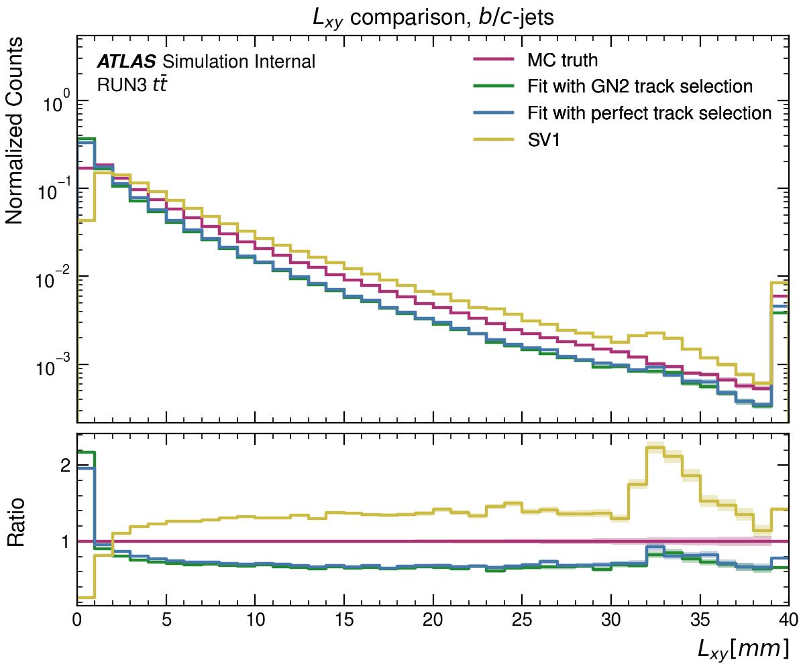

# Vertex Fit with GN2's track origin predictions

The code in this repository produces the $L_{xy}$ comparison between the vertex fitting performed with GN2's track selection v.s. with "perfect track selection" (i.e. using the Montecarlo truth track origins to select which tracks are to be fitted). Results can be found in `images`. Here is the result of the comparison on $b/c-$ jets:
<center>

</center>

## Structure of the repository
```
├── docs
│   └── SVFsAlgorithm.md: explanation of the fitter algorithm
├── fit.py: vertex fit script
├── fit_results.dat: fit results on ~50K jets
├── plots.py: plots script
├── images: plots output
├── modules
│   ├── containers.py: container for tracks and jets
│   ├── ImportH5.py: function to read H5 files
│   └── singleVertexFitter.py: vertex fitter
├── README.md
```

## Reproducibility

Here are the instructions to reproduce these results.

> :warning: **Code Dependencies** <br> 
To run this code, you need to install [PUMA](https://github.com/umami-hep/puma) and `numpy`.

### Reproduce the fit

To reproduce the fit an ATLAS `.h5` file is needed in this directory. The `.h5` file that was used to produce these results can be found in my `public` area on `eos`:
```shell
/afs/cern.ch/user/l/lderin/public/vertex-fit-h5/ttbar.h5
```

> :memo: **`H5` fields names may vary!**<br>
If you are running this code on a different ATLAS `H5` file, it is possible that some field names are different from my version, resulting in a code crash. For instance, the field `ftagTruthOriginLabel` was recently renamed.

When an `H5` file is added to the repository, to perform the fit run the `fit.py` script: it will automatically detect the `H5` file.

The `fit.py` script saves its results in the `fit_results.dat` file, which is later used by the `plots.py` script to produce the plots.

### Reproduce the plots

To reproduce the plots it is not necessary to have an `H5` file in this repository: the fit results on a $\sim50K$ jet sample are stored in `fit_results.dat`. The `plots.py` script, which produces the plots, runs on that file and saves the results in the `images` folder.